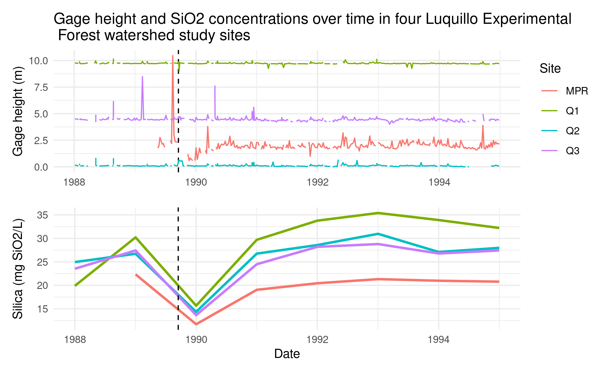

```{r setup, include=FALSE}
options(htmltools.dir.version = FALSE)
```
---
# Challenges

- Getting data into our project from the data file

```{r eval=FALSE, tidy=FALSE}
q1 <- read_csv("../../../../courses/EDS214/topatopa/data/QuebradaCuenca1-Bisley.csv", na = c("-9999", ""))

q2 <- read_csv("../../../../courses/EDS214/topatopa/data/QuebradaCuenca2-Bisley.csv", na = c("-9999", ""))

q3 <- read_csv("../../../../courses/EDS214/topatopa/data/QuebradaCuenca3-Bisley.csv", na = c("-9999", ""))

mpr <- read_csv("../../../../courses/EDS214/topatopa/data/RioMameyesPuenteRoto.csv", na = c("-9999", ""))
```
--
later...
```{r eval=FALSE, tidy=FALSE}
## Turns out starting with the slash takes us to the root directory
## and we can go down the file path from there... getting the 
## dot dots to work was cool too though.

q1 <- read_csv("/courses/EDS214/topatopa/data/QuebradaCuenca1-Bisley.csv", na = c("-9999", ""))

q2 <- read_csv("/courses/EDS214/topatopa/data/QuebradaCuenca2-Bisley.csv", na = c("-9999", ""))

q3 <- read_csv("/courses/EDS214/topatopa/data/QuebradaCuenca3-Bisley.csv", na = c("-9999", ""))

mpr <- read_csv("/courses/EDS214/topatopa/data/RioMameyesPuenteRoto.csv", na = c("-9999", ""))
```

---
# Challenges

- Establishing a workflow    

--

- Occasionally stumbling into merge conflicts    

--

- getting dates to be considered dates    

--

- ggplot  

---
# Our work...

you can see all of our work on [github](https://github.com/petermenzies/topatopa)

```{r echo=FALSE}

```


---


