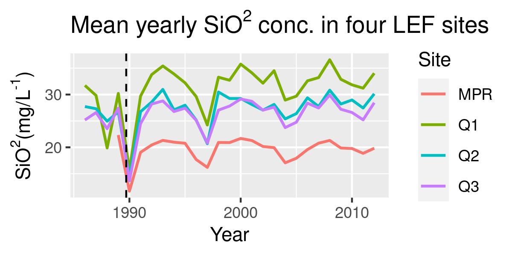
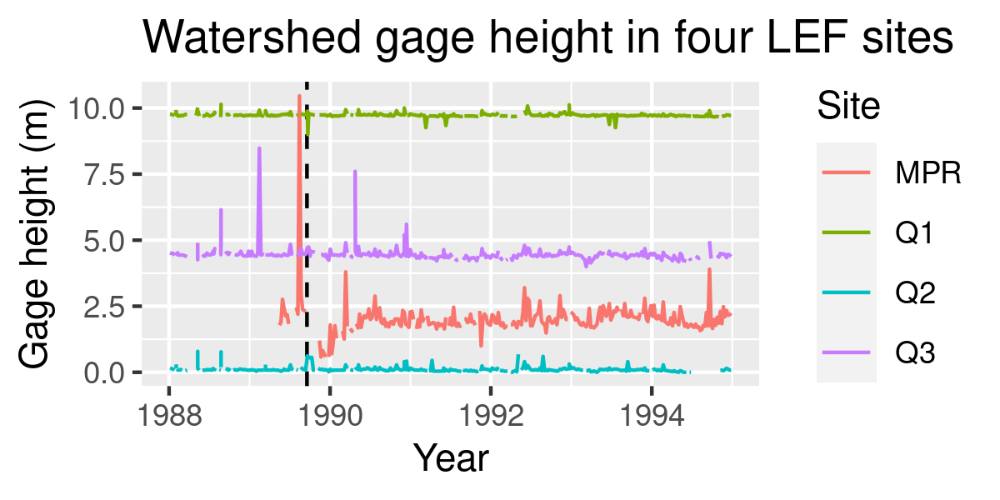
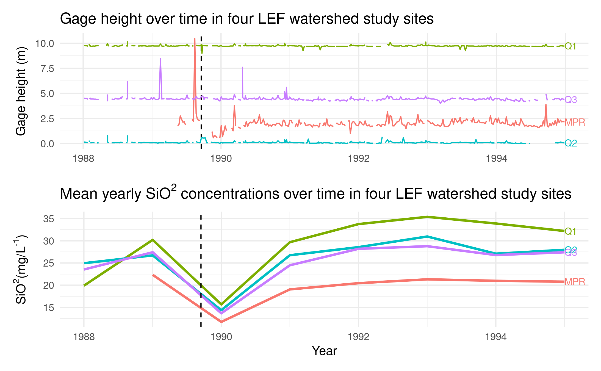

```{r setup, include=FALSE}
options(htmltools.dir.version = FALSE)
```

class: left

# Team Organization

- ### We used pair programming to read in, clean, and wrangle the four data sets we worked with

- ### Using our single, joined data frame, we individually explored different variables and relationships

- ### As a group we decided which relationships to present on and create a final visualization with

- ### Daniel created our final visualization and described our challenges. Halina fine-tuned the final viz appearance and documented our workflow and how we set up the project. Peter detailed group roles and documented our results.


---
class: left

# Results

### We plotted mean yearly SiO<sup>2</sup> concentrations at each site and found a large decrease that coincided with Hugo

```{r, echo = FALSE}

```

---
class: left

# Results

### We also plotted gage height at all sites as a time series surrounding Hugo and found an inverse relationship with SiO<sup>2</sup>

```{r, echo = FALSE}

```

---

class: left

# Results

### We combined the two plots into a final visualization comparing gage height and SiO<sup>2</sup> conc. over time at the four LEF sites

---

class: left

# Results: final visualization

```{r, echo = FALSE}

```


---
background-image: url(`r xaringan:::karl`)
background-position: 50% 50%
class: center, bottom, inverse

# You only live once!