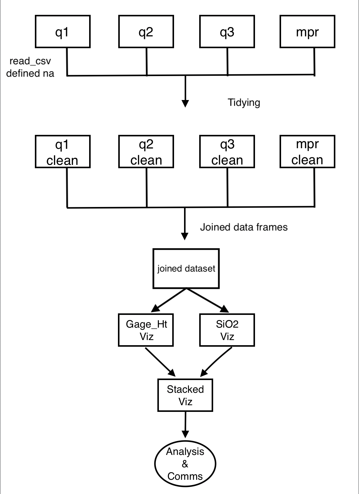

```{r setup, include=FALSE}
knitr::opts_chunk$set(echo = TRUE)
```

# Goal/Question + workflow you used to achieve it

## Goal/ Question

Goal: To investigate the impact of Hurricane Hugo on stream chemistry data in The Luquillo Experimental Forest (LEF).

Question: How did Hurricane Hugo affect other stream chemistry data in the LEF?

## Workflow

```{r}

```

# How did you set up your project (server, data, code, …)

```{r}

<<<<<<< HEAD

=======
>>>>>>> 1b2de91321b2003aa2a826222fe6aaaa88dcb84d

```

