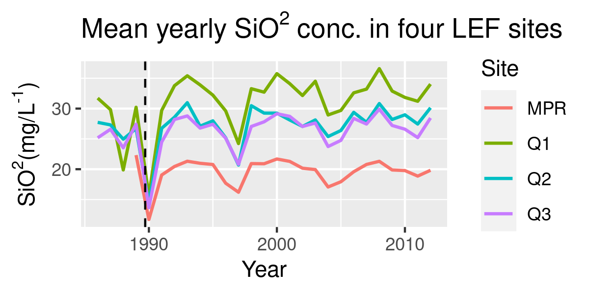

```{r setup, include=FALSE}
options(htmltools.dir.version = FALSE)
```

# Goal/Question + workflow you used to achieve it

## Goal/ Question

Goal: To investigate the impact of Hurricane Hugo on stream chemistry data in The Luquillo Experimental Forest (LEF).

Question: How did Hurricane Hugo affect other stream chemistry data in the LEF?

---
## Workflow

```{r, echo=FALSE, out.width="50%", out.height="50%", fig.align="center"}

```

---

# How did you set up your project (server, data, code, …)
```{r, echo=FALSE, out.width="75%", out.height="75%", fig.align="center"}


```

---
class: left

# Team Organization

- ### We used pair programming to read in, clean, and wrangle the four data sets we worked with

- ### Using our single, joined data frame, we individually explored different variables and relationships

- ### As a group we decided which relationships to present on and create a final visualization with

- ### Daniel created our final visualization and described our challenges. Halina fine-tuned the final viz appearance and documented our workflow and how we set up the project. Peter detailed group roles and documented our results.


---
class: left

# Results

### We plotted mean yearly SiO<sup>2</sup> concentrations at each site and found a large decrease that coincided with Hugo

```{r, echo = FALSE}

```

---
class: left

# Results

### We also plotted gage height at all sites as a time series surrounding Hugo and found an inverse relationship with SiO<sup>2</sup>

```{r, echo = FALSE}
knitr::include_graphics("figs/peter_gage_plot.png")
```

---

class: left

# Results

### We combined the two plots into a final visualization comparing gage height and SiO<sup>2</sup> conc. over time at the four LEF sites

---

class: left

# Results: final visualization

```{r, echo = FALSE}
knitr::include_graphics("figs/sio2_gage_plot.png")
```

---
# Challenges

- Reading in our data

```{r eval=FALSE, tidy=FALSE}
q1 <- read_csv("../../../../courses/EDS214/topatopa/data/QuebradaCuenca1-Bisley.csv", na = c("-9999", ""))

q2 <- read_csv("../../../../courses/EDS214/topatopa/data/QuebradaCuenca2-Bisley.csv", na = c("-9999", ""))

q3 <- read_csv("../../../../courses/EDS214/topatopa/data/QuebradaCuenca3-Bisley.csv", na = c("-9999", ""))

mpr <- read_csv("../../../../courses/EDS214/topatopa/data/RioMameyesPuenteRoto.csv", na = c("-9999", ""))
```
--
later...
```{r eval=FALSE, tidy=FALSE}
## Turns out starting with the slash takes us to the root directory
## and we can go down the file path from there... getting the 
## dot dots to work was cool too though.

q1 <- read_csv("/courses/EDS214/topatopa/data/QuebradaCuenca1-Bisley.csv", na = c("-9999", ""))

q2 <- read_csv("/courses/EDS214/topatopa/data/QuebradaCuenca2-Bisley.csv", na = c("-9999", ""))

q3 <- read_csv("/courses/EDS214/topatopa/data/QuebradaCuenca3-Bisley.csv", na = c("-9999", ""))

mpr <- read_csv("/courses/EDS214/topatopa/data/RioMameyesPuenteRoto.csv", na = c("-9999", ""))
```

---
# Challenges

- Establishing a workflow    

--

- Occasionally stumbling into merge conflicts    

--

- getting dates to be considered dates    

--

- ggplot  

---
# Our work...

you can see all of our work on [github](https://github.com/petermenzies/topatopa)

```{r echo=FALSE}
knitr::include_graphics("figs/sio2_gage_plot.png")
```


---
background-image: url(`r xaringan:::karl`)
background-position: 50% 50%
class: center, bottom, inverse

# You only live once!